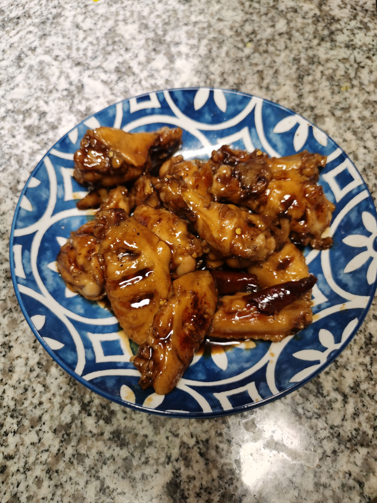

# Coke Chicken Wing 可乐鸡翅

## Ingredient
- 鸡翅
- 可乐
- 胡椒粉
- 生抽
- 耗油
- 料酒
- 生姜
- 辣椒
- 老抽
- 盐

## Steps

1. 在鸡翅上割几个口子
2. 放盐水浸泡十分钟去腥
3. 放生抽，蚝油，料酒，胡椒粉腌入味
4. 放油煎鸡翅至金黄
5. 拿出鸡翅
6. 放入姜小炒一下
7. 放入可乐，辣椒
8. 至沸腾后放入鸡翅
9. 放入鸡翅
10. 收汁后加入老抽和柠檬汁调色调味

## Image

