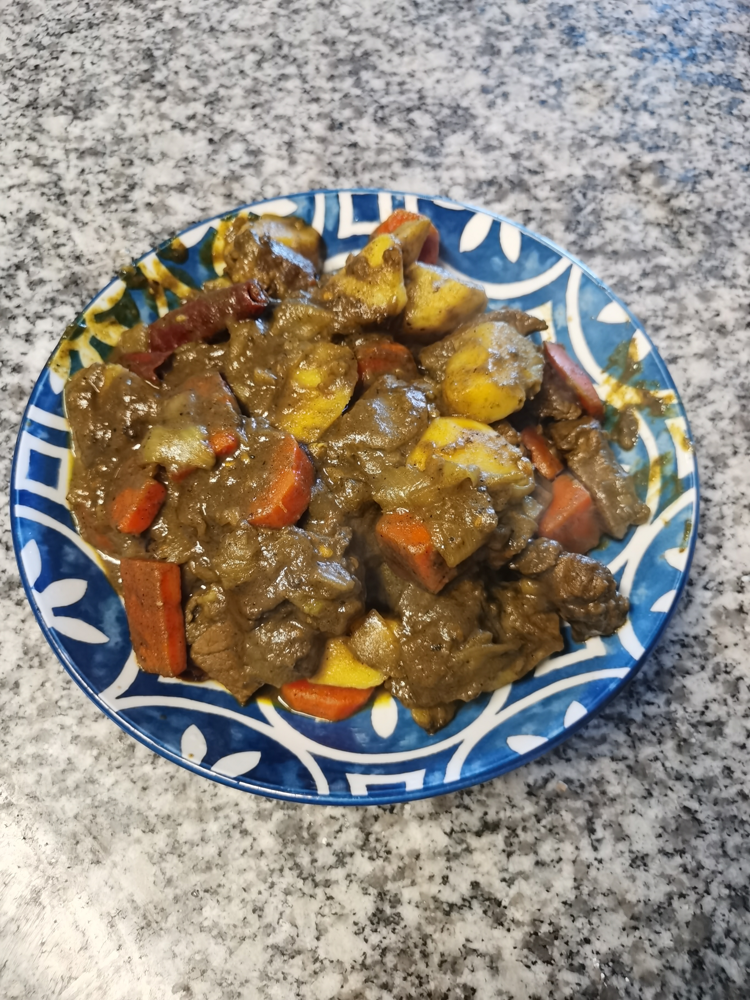
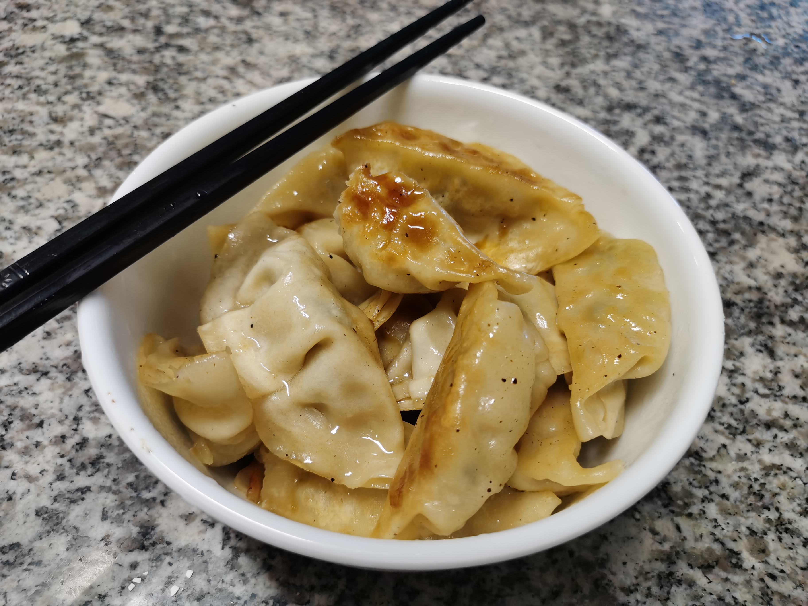
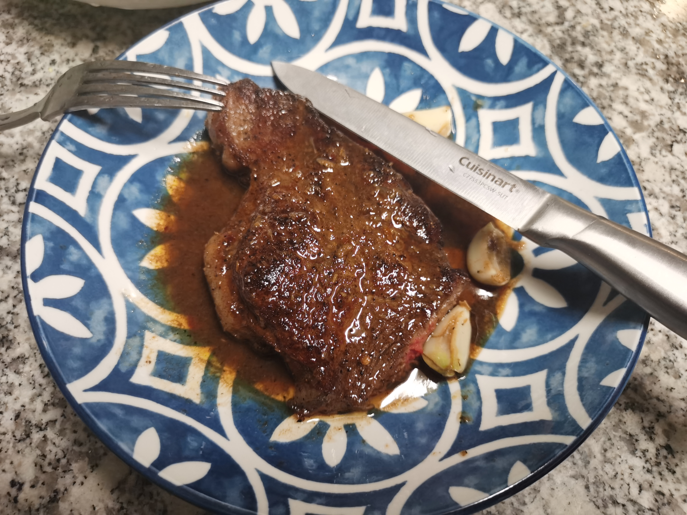

# Coke Chicken Wing 

## Ingredient
- 鸡翅
- 可乐
- 胡椒粉
- 生抽
- 耗油
- 料酒
- 生姜
- 辣椒
- 老抽
- 盐

## Steps

1. 在鸡翅上割几个口子
2. 放盐水浸泡十分钟去腥
3. 放生抽，蚝油，料酒，胡椒粉腌入味
4. 放油煎鸡翅至金黄
5. 拿出鸡翅
6. 放入姜小炒一下
7. 放入可乐，辣椒
8. 至沸腾后放入鸡翅
9. 放入鸡翅
10. 收汁后加入老抽和柠檬汁调色调味

## Image

# Curry Potato Beef

## ingredient

1. 土豆
2. 牛腩
3. 苹果汁
4. 一颗洋葱
5. 料酒
6. 土豆块，胡萝卜块
7. 咖喱
8. 两勺生抽
9. 半勺老抽
10. 两勺蜂蜜
11. 牛奶 

## Step
0. 牛肉泡血水，切好洋葱
1. 将洋葱炒香
2. 炒牛肉
3. 放水煮
4. 切胡萝卜，土豆
5. 放入咖喱，土豆，胡萝卜，生抽，老抽，蜂蜜，牛奶
6. 煮半小时

## Image

# Fried Dumpling

## Ingredient
饺子

## Step
1. 将饺子解冻
2. 放入锅中，放入适量油，煎至金黄
3. 放入适量水
4. 蒸干水后出锅

## Image

# Steak

## Ingredient

### for steak
- steak
- black pepper powder
- salt
- butter

### for 沙茶汁
- 3 garlic
- 20 gram ginger
- 2 shallots
- barbeque sauce (沙茶酱)
- soy sauce (生抽)
- oyster sauce (蚝油)
- pepper powder (白胡椒粉)

## Steps
1. 用厨房巾将牛肉表面的血水吸干（重要！）
2. 撒盐，胡椒粉，油，涂抹在牛排表面，腌制二十分钟
3. 下油开火，当冒白烟时候下牛排。根据几成熟选择煎的时间，详见下表。

    1、近生牛排（Blue Rare）

    正反两面各加热一分钟，锁住牛排内水分，使外部肉质和内部生肉产生口感差，外层便于挂汁，内层生肉保持原始肉味。

    2、一分熟牛排（Rare）

    两面各煎1-2分钟，牛排内部为血红色且内部保持一定温度，同时有生熟部分。

    3、三分熟牛排（Medium Rare）

    两面各煎2-3分钟，大部分肉受热量渗透传至中心，切开后两侧熟肉呈棕色，向中心转为粉色至鲜肉色。

    4、五分熟牛排（Medium）

    两面各煎3-4分钟，牛排内部区域粉红，夹杂着熟肉的浅灰和棕褐色，整个牛排温度口感均衡。

    5、七分熟牛排（Medium Well）

    两面各煎4-5分钟，牛排内部主要为浅灰棕褐色，夹杂着少量粉红色，质感偏厚重，有咀嚼感。

    6、全熟牛排（Well Done）

    两面各煎5-6分钟，牛排通体为熟肉褐色，牛肉整体已经烹熟，口感厚重。

    （Cited from 牛小燃 in Zhihu）

4. 煎牛排的时候可以选择性放入黄油块，黄油化开后洒在牛排上

5. 出锅后，放入姜，蒜炒香，放入沙茶汁，收汁后洒在牛排上。

### Image

