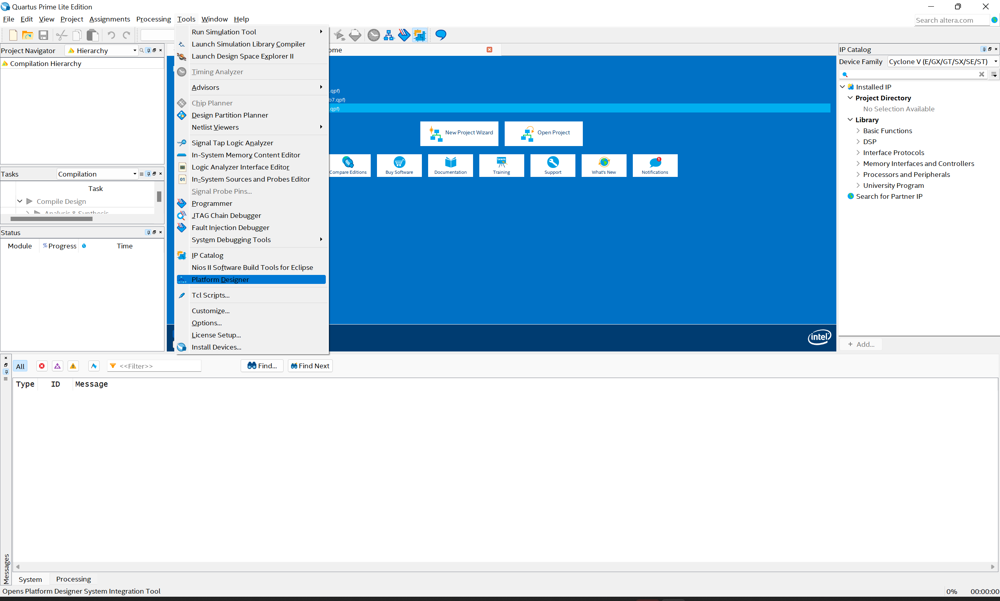
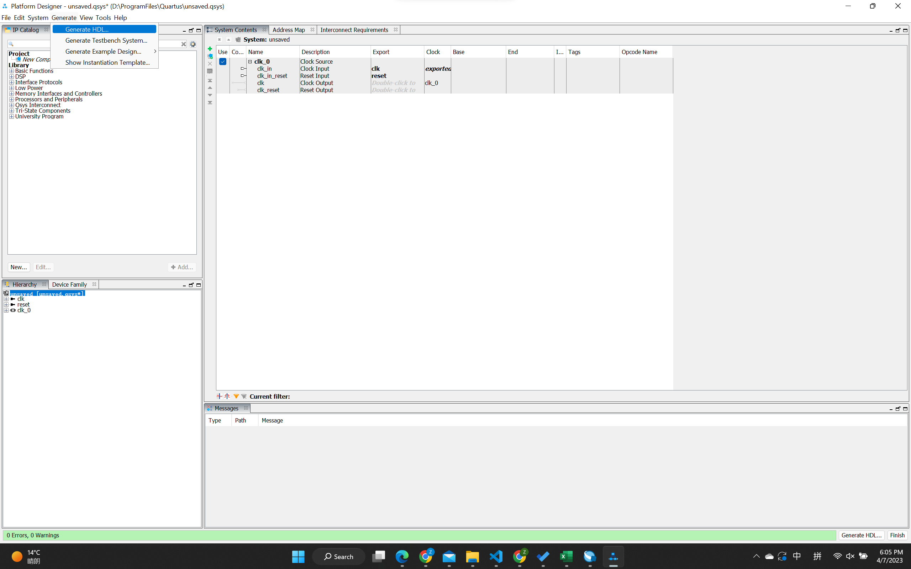
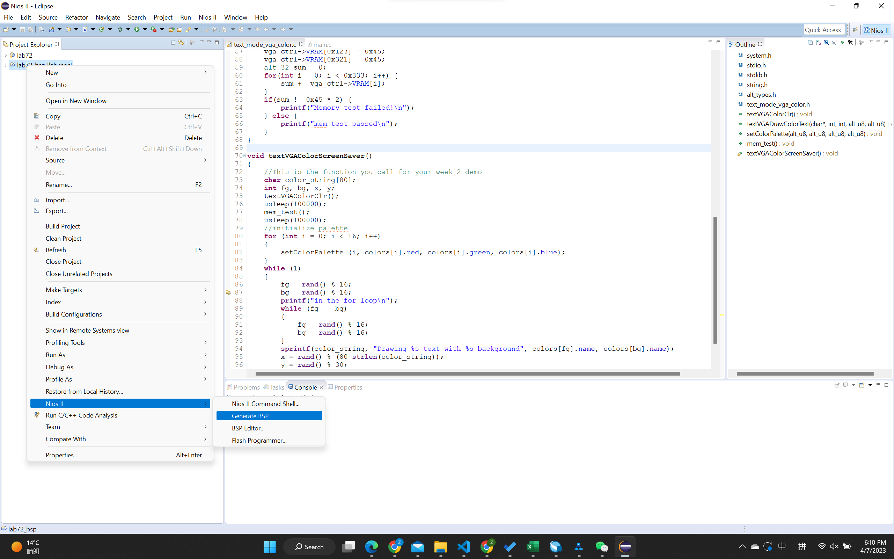
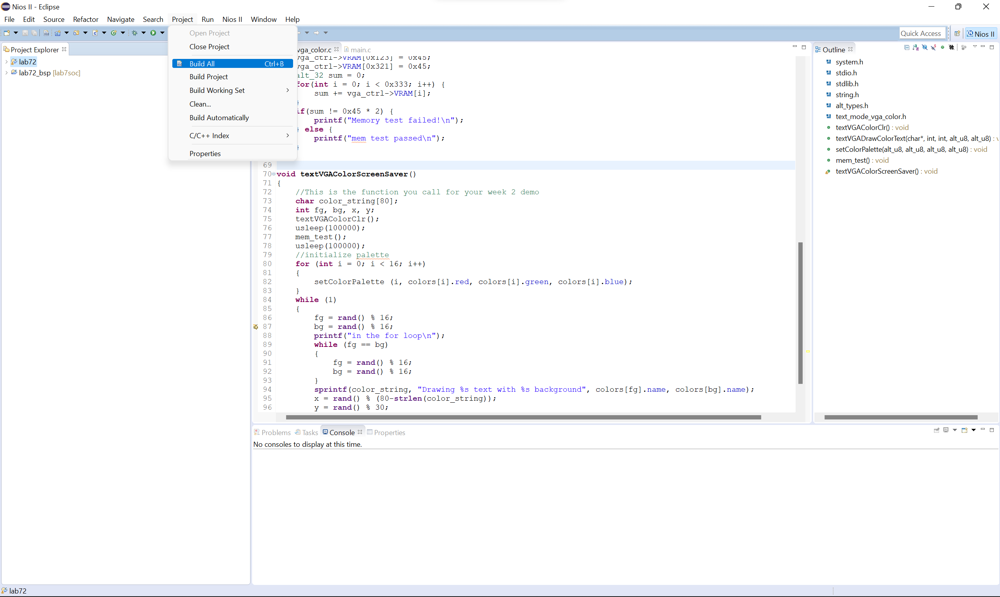
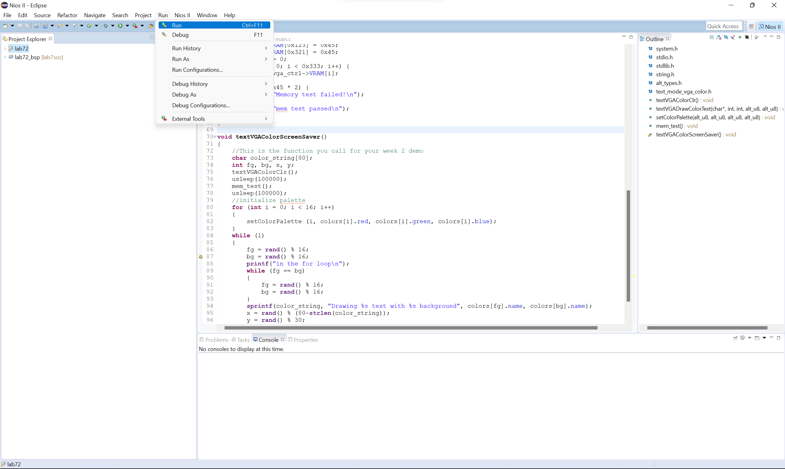

# ECE385 Note 1

## Problem Statement

After finishing the fpga software and hardware design using Quartus, connecting all the stuff together and downloading the program to the board is annoying, here is the detailed steps in case I forget it. (Software designed by Intel sucks!)

## Step 0

If you include your self defined IP module, firstly you should `generate HDL` in `platform designer` under the `tool`.

## Step 1

Compile the whole project

## Step 2

Download the program to the board.

## Step 3

If you use the software (use the NIOS processor), go to the `Nios II Software Build Tools for Eclipse` under the `tool`. 

First, click `generate BSP`.

Then, click `build all` for your software code.

Finally, run!

