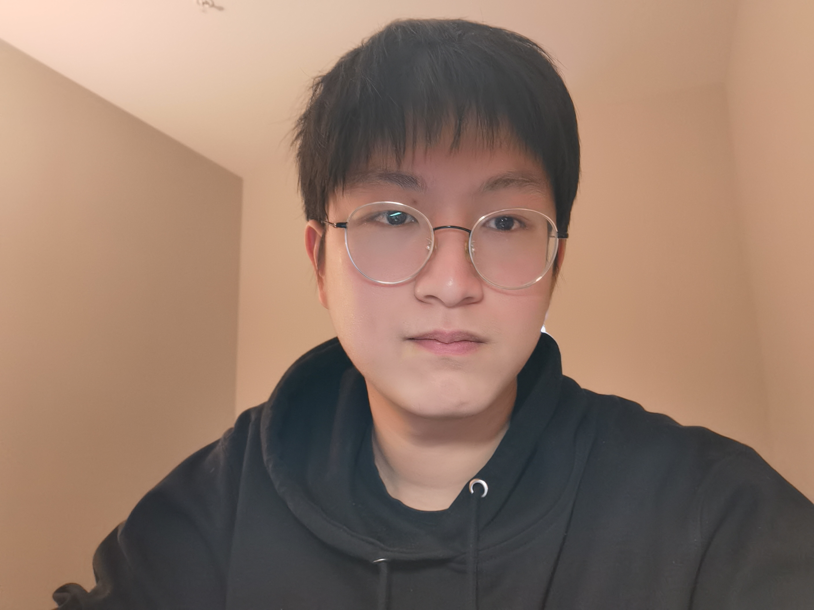

## About Me

Hi! I am a junior year student of B.E. Computer Engineering at University of Illinois at Urbana-Champaign, USA (GPA: 4/4). I also have an Electrical and Computer Engineering degree at Zhejiang University (GPA: 3.92/4), China.

## Research Interest

I am experienced in bioinformatics and have previously conducted research on tooth segmentation in 3-dimensional intraoral mesh scans using unsupervised learning under the supervision of [Prof. Zuozhu Liu](https://person.zju.edu.cn/en/lzz) in ZJU-UIUC Institute. Currently, I am focused on identifying influential SNP markers for Alzheimer's disease underthe supervision of [Prof. Haohan Wang](https://haohanwang.github.io/) in UIUC. As a researcher in the medical field, I am keenly aware of the importance of trustworthy AI and am also interested in the area of machine learning security.

I am always looking for opportunities to collaborate with other researchers in related fields. If you are interested in collaborating on a project related to bioinformatics, machine learning security, or medical AI, please do not hesitate to contact me.

## Skills

Skill | Capability
-----|-------
Programming Languages | Python(proficient), C(proficient), C++, X86, SQL, JavaScript, SystemVerilog
Tool | Pytorch, Sklearn, Quartus, react, Latex, PLINK
Language | Mandarin, English: TOEFL 109 (R: 30, L: 29, S: 22, W: 28)

## Honors

- First-class Scholarship of Zhejiang University (*Top 3%*) * 2 (2021, 2022)

- Scholarship from the government of Zhejiang Province (*Top 3%*) * 2 (2021, 2022)

- ZJUI Academic Scholarship - Second Prize (*Top 3%*) * 2 (2021, 2022)

- Outstanding Students of Zhejiang University * 2 (2021, 2022)

- Outstanding Individual in Community Survice of Zhejiang University (2021)

## Competitions

- Finalist (*Top 1%*) in 2022 MCM (International Mathematical Contest In Modeling)

- First Prize (*Top 5%*) in 2022 CMC (Chinese Mathematics Competition) 

