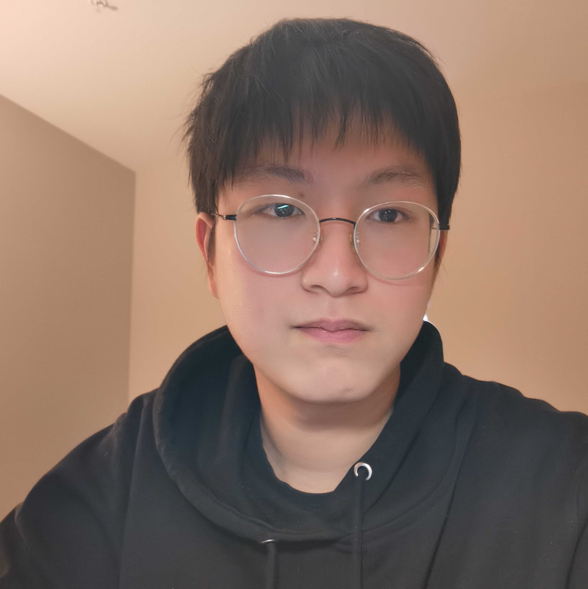

## About Me

Hi! I am a second year master student of Computer Science at Institute of Computing Technology, Chinese Academy of Sciences, China. I'm fortunately supervised by [Prof. Ying Wang](https://wangying-ict.github.io/). Previously I got my bachelor degree at Zhejiang University and UIUC in 2024. My research interest is in LLM for hardware design right now, feel free to check our models in [huggingface](https://huggingface.co/aichipdesign).

I interned at [Moonshot AI](https://www.moonshot.cn/) in 2026 Spring, focusing on post-training for coding. Before that, I spent a wonderful spring at TikTok in 2024, working on recommendation system refactoring and bringing engineering and business metrics improvement to multiple TikTok apps.

## Publication

**[Pub1]** Kimi K2.5: Visual Agentic Intelligence. *Technical Report, Main Contributor*

**[Pub2]** **Zhirong Chen**, Kaiyan Chang, Zhuolin Li, Cangyuan Li, Xinyang He, Chujie Chen, Mengdi Wang, Haobo Xu, Yinhe Han, Huawei Li, Ying Wang. ChipSeek: Optimizing Verilog Generation via EDA-Integrated Reinforcement Learning. *ACL 2026 Main Conference*

**[Pub3]** Kaiyan Chang\*, Mingzhi Chen\*, Yunji Chen\*, **Zhirong Chen\***, et al. Large Processor Chip Model. *SCIENCE CHINA Information Sciences* (\* Equal Contribution)

**[Pub4]** Kaiyan Chang, Yiming Gan, Wenlong Zhu, Kun Wang, **Zhirong Chen**, Yuan Cheng, Yinhe Han, Huawei Li, Ying Wang. ScaleGS: Closing the Gap between Real-time 3D Gaussian Splatting and Real-time XR Rendering. *TACO*

**[Pub5]** Yudong Pan, Yintao He, Tianhua Han, Lian Liu, Shixin Zhao, **Zhirong Chen**, Mengdi Wang, Cangyuan Li, Yinhe Han, Ying Wang. TriMoE: Augmenting GPU with AMX-Enabled CPU and DIMM-NDP for High-Throughput MoE Inference via Offloading. *DAC 2026*

**[Pub6]** **Zhirong Chen**, Caleb Ellington, Eric Xing, Haohan Wang. Heteroscedastic Personalized Regression Unveils Genetic Basis of Alzheimer’s Disease Stratified by Cognitive Level. *BioRxiv*

**[Pub7]** Kaiyan Chang, Kun Wang, Nan Yang, Ying Wang, Dantong Jin, Wenlong Zhu, **Zhirong Chen**, Cangyuan Li, Hao Yan, Yunhao Zhou, Zhuoliang Zhao, Yuan Cheng, Yudong Pan, Yiqi Liu, Mengdi Wang, Shengwen Liang, Yinhe Han, Huawei Li and Xiaowei Li. Data is all you need: Finetuning LLMs for Chip Design via an Automated design-data augmentation framework. *DAC 2024*

**[Pub8]** Kaiyan Chang, **Zhirong Chen**, Yunhao Zhou, Wenlong Zhu, Kun Wang, Haobo Xu, Cangyuan Li, Mengdi Wang, Shengwen Liang, Huawei Li, Yinhe Han and Ying Wang. Natural language is not enough: Benchmarking multi-modal generative AI for Verilog generation. *ICCAD 2024*

**[Pub9]** Kaiyan Chang, Wenlong Zhu, Kun Wang, Xinyang He, Nan Yang, **Zhirong Chen**, Dantong Jin, Cangyuan Li, Yunhao Zhou, Hao Yan, Zhuoliang Zhao, Yuan Cheng, Mengdi Wang, Shengwen Liang, Yinhe Han, Xiaowei Li, Huawei Li, Ying Wang. A data-centric chip design agent framework for Verilog code generation. *TODAES*

## Honors

- Graduate at UIUC with Highest Honors (2024)

- Outstanding Graduate in Zhejiang Province (2024)

- Yunni and Maxine Pao Memorial Scholarship from UIUC, $3000 (2023)

- Zhejiang University Scholarship - First Prize $\times$ 3 (2021, 2022, 2023)

- Scholarship from the government of Zhejiang Province $\times$ 3 (2021, 2022, 2023)

## Competitions

- [Finalist](https://github.com/rong-hash/MCM_2022) (*Top 1%*) in 2022 MCM (International Mathematical Contest In Modeling)

- First Prize (*Top 5%*) in 2022 CMC (Chinese Mathematics Competition) 

<!-- 
 -->

