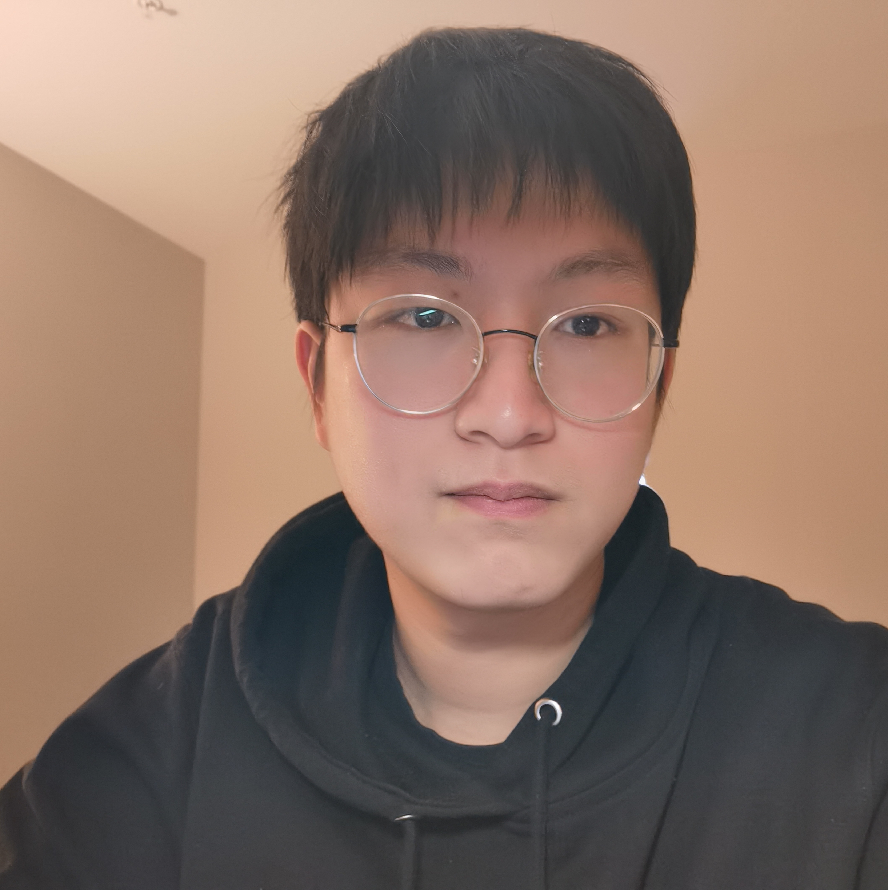

## About Me

Hi! I am a master student of Computer Science at Institute of Computing Technology, Chinese Academy of Sciences, China. I'm fortunately supervised by [Prof. Ying Wang](https://wangying-ict.github.io/). Previously I got my bachelor degree at Zhejiang University and UIUC in 2024. My research interest is in LLM for hardware design right now.

In 2024, I spent a wonderful spring at Tiktok working on Tiktok recommendation system refactoring. I brought engineer and business metrics improvement on multiple Tiktok Apps.

## Publication

**[Pub1]** **Zhirong Chen**, Caleb Ellington, Eric Xing, Haohan Wang. Heteroscedastic Personalized Regression Unveils Genetic Basis of Alzheimer’s Disease Stratified by Cognitive Level. 

**[Pub2]** Kaiyan Chang, Kun Wang, Nan Yang, Ying Wang, Dantong Jin, Wenlong Zhu, **Zhirong Chen**, Cangyuan Li, Hao Yan, Yunhao Zhou, Zhuoliang Zhao, Yuan Cheng, Yudong Pan, Yiqi Liu, Mengdi Wang, Shengwen Liang, yinhe han, Huawei Li and Xiaowei Li. Data is all you need: Finetuning LLMs for Chip Design via an Automated design-data augmentation framework. *DAC 2024*

**[Pub3]** Kaiyan Chang, **Zhirong Chen**, Yunhao Zhou, Wenlong Zhu, Kun Wang, Haobo Xu, Cangyuan Li, Mengdi Wang, Shengwen Liang, Huawei Li, Yinhe Han and Ying Wang. Natural language is not enough: Benchmarking multi-modal generative AI for Verilog generation. *ICCAD 2024*

## Skills

Skill | Capability
-----|-------
Programming | Python, C, C++, CUDA, X86, SQL, MongoDB, JavaScript, System Verilog, Verilog
Tool | Pytorch, Quartus, VCS, Nsys, FPGA, Latex, PLINK, react, MySQL Workbench, Git, Docker, CMake
Language | Mandarin, English: TOEFL 109 (R: 30, L: 29, S: 22, W: 28)

## Honors

- Graduate at UIUC with Highest Honors (2024)

- Outstanding Graduate in Zhejiang Province (2024)

- Yunni and Maxine Pao Memorial Scholarship from UIUC, $3000 (2023)

- Zhejiang University Scholarship - First Prize $\times$ 3 (2021, 2022, 2023)

- Scholarship from the government of Zhejiang Province $\times$ 3 (2021, 2022, 2023)

- ZJUI Academic Scholarship - Second Prize $\times$ 3 (2021, 2022, 2023)

- Outstanding Students of Zhejiang University $\times$ 3 (2021, 2022, 2023)

- Student Innovation and Entrepreneurship Award $\times$ 2 (2022, 2023)

- Outstanding Individual in Community Survice of Zhejiang University (2021)

- Outstanding Summer Research in Zhejiang University

- UIUC Dean's List (2021, 2022, 2023)

## Competitions

- [Finalist](https://github.com/rong-hash/MCM_2022) (*Top 1%*) in 2022 MCM (International Mathematical Contest In Modeling)

- First Prize (*Top 5%*) in 2022 CMC (Chinese Mathematics Competition) 

  

## Experience

> **Intern**: Develop the recommendation system
> 
> Company: Tiktok
>
> Time: Jan 2024 - Apr 2024
>
> Contribution: I mainly worked on the DAG refactoring of the Tiktok recommendation system. I brought several engineer metrics gain and business metrics gain and finally got the return offer.

> **Research**: Chipgpt: Towards Training Hardware Generation Large Language Model
>
> Supervisor: [Ying Wang](https://wangying-ict.github.io/) *Professor, Institute of Computing Technology, Chinese Academy of Science*
>
> Time: Aug 2023 - Now
>
> Contribution: I mainly work on the hardware data augmentation framework and technology of finetuning the large language model on chip design tasks. I have published 2 papers in DAC and ICCAD until now.

> **Research**: Personalized Model - Precise Alzheimer's Genetic Discovery
>
> Supervisor: [Haohan Wang](https://haohanwang.github.io/) *Assistant Professor, UIUC* 
>
> Time: Dec. 2022 - Nov. 2023
>
> Contribution: Develop the personalized algorithm on recognizing the Alzheimer's diseases related genes.

