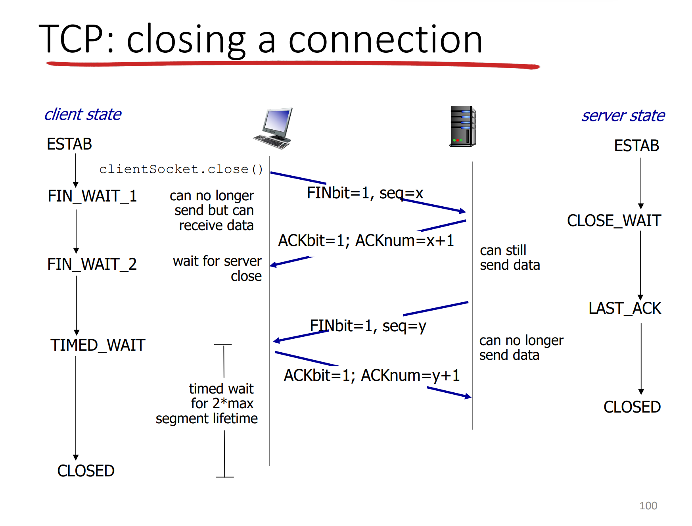

# TCP Protocol Implementation

## Foreword
When I tried to implement TCP protocol, it's hard for me to find a whole teaching document on Google that tell me how to implement it in details. Most of them are talking about only part of the protocol, like congestion control, 3 way handshake, etc. So I can't form a whole picture of TCP. After going through a long and tough time I finally understand the protocol thoroughly, and here I want to introduce the protocol in a heulistic way.

## Definition

What is TCP? In short it is a trustworthy protocol program in Transport Layer, which can transmit the packet safely. Unlike UDP, you don't have to worry that there is loss of packet or wrong bits inside the packet. You can think TCP as a post office: you give the message to it, then it will safely transport the message to the receiver. 

## Whole Picture

TCP can be roughly divided into 3 stages. 

1. Building Connection
2. Send / receive message
3. Close Connection

Among them, send / receive message is the most tedious one.

To make it clear for the reader, I would inform you of the behavior of both receiver and sender in each of three stages.

## Sender / Receiver Behaviors

Simplified state machine of whole TCP behavior of sender and receiver

## Build Connection (3 way handshake)

### Why 3 handshake

Why not only 2 handshake, or 4 handshake?

3 handshake reason:

1st handshake: send connection invitation

2nd handshake: tell sender that receiver get the invitation

3rd handshake: tell the receiver that sender knows the connection established

Some blog may talk about some bad result caused by the 2 way handshake or 1 way handshake, but I want you to understand the 3 way handshake more thoroughly.

The core problem of connection establishment is that the communication channel is unreliable, but both the receiver and sender need reach an agreement that the connection is bothway connected. In the first and second handshake, sender knows that message can be sent from sender to receiver and from receiver and sender; in the second and third handshake, the receiver knows that message can be sent from sender to receiver and from receiver and sender. 3 way handshake is the smallest handshake that can make both sides confirm on the connection.

### Scenario

## Send / Receive Message (ESTAB state in image 1)

### Basic Introduction

The establishment stage is totally based on how we implement the congestion control, flow control, RTT estimation, Packet Retransmit Strategy.

### Brief Introduction of Terminology

1. Congestion Control: Avoid congestion of network. TCP congestion control is one of the techniques.
2. Flow Control: Avoid buffer overflow in the receiver
3. RTT estimation: Estimate RTT in order to give a reasonable timeout in sender
4. Packet Retransmit: Strategy when the packet is lost. Go Back N (GBN) and Selective Repeat (SR) are two popular strategies.

### Data Structure

This is the standard TCP structure. However, for my implementation, I found that only the following is enough.

1. SeqNum
2. AckNum
3. Flag (SYN, ACK, FIN, DATA, RST)
4. Data Length
5. Data

### Flag Explanation
SYN: Connection establishment flag. The first segment should use this flag.

ACK: Segment sent by receiver should use this flag

FIN: Close Connection Segment should use it.

DATA: Data segment

RST: When no connection is established but receiver receive data segment, it should send the segment with this flag to tell the sender no connection is estabished.

### Implementation Thought

My implentation is mainly based on the Congestion Control and Packet Retransmit. Here I use GBN as my retransmit strategy. RTT estimation is not that important, you can just set the timeout a constant, but formula is still put on this blog though. And Flow Control can be avoided by using a circle list. 

### RTT estimation Formula:

$$ EstimateRTT = (1 - \alpha) \times EstimateRTT + \alpha \times SampleRTT $$

$$ DevRTT = (1 - \beta) \times DevRTT + \beta \times |EstimateRTT - SampleRTT| $$

$$ Timeout = EstimateRTT + 4 \times DevRTT $$

### Sender Behavior

**Explanation of State Machine**

CWND: sending window, count by bytes

timeout: time to wait ack. If timeout, send the segment again and go back to Slow Start.

dupACK: Whenever the receiver receives an segment out of order, it means that the segment may be lost, so the sender would send the base segment (first segment in the sending window) immediately to receiver whenever there are 3 dupACK.

ssthreashold: When slow start reaches the threshold, it would become Congestion Control. The increasing speed of sending window size is slowing down to avoid network congestion.

Slow Start: Not slow at all. Whenever the sender receive an ack, it would add CWND by 1 segment size. It's called slow start mainly because cwnd is small.

Congestion Avoidance: Add the sending window very slowly. Most of time the sender should be in this state.

Fast Recovery: When a segment is lost, but timeout not touched, then it would go to fast recovery. It means network is in a not too bad congestion, can still send some messages.

## Receiver Behavior

Much easier than sender.

Whenever the receiver receives a segment, it sends back the ACK immediately. If there is an out of order segment, then stores the segment in the buffer and sends the duplicate ack. When the lost segment is sent again from sender, receiver would then calculate the new ack based on the new buffer base.

Notice some blogs cheat you that receiver should only send the ack after a period of time (timeout). That's not suitable for congestion control design.

## Implementation Trick

1. Both sender and receiver use a circular array. When the segment index is out of the array, it would then go back to the start of the array. It is easy to implement using %.
2. When getting the duplicate ACK, sender only needs to send the lost segment once. Then in the Fast Recovery state, it doesn't need to send the lost segment, otherwise it would cause some serious networking problem. The sending speed would be very slow and waste a lot of network resourse.

## 4 way Handshake

After sending all you want, we should close the connection. How to do it? 4 way handshake!

The reason for 4 way handshake is quite similar to 3 way handshake. Readers can search why it is if interested.

# Summary

So that's all about the TCP. Hope you can implement the protocol quickly!